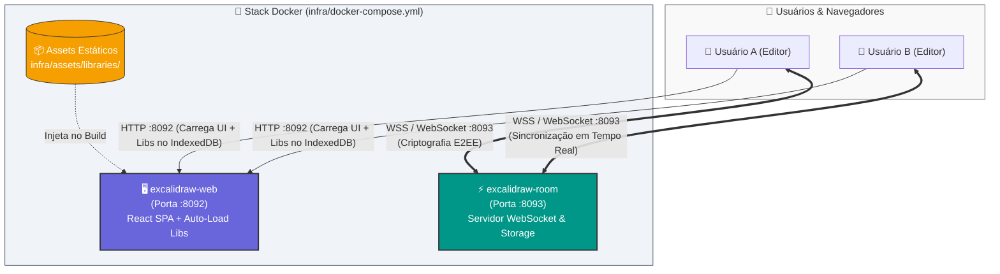
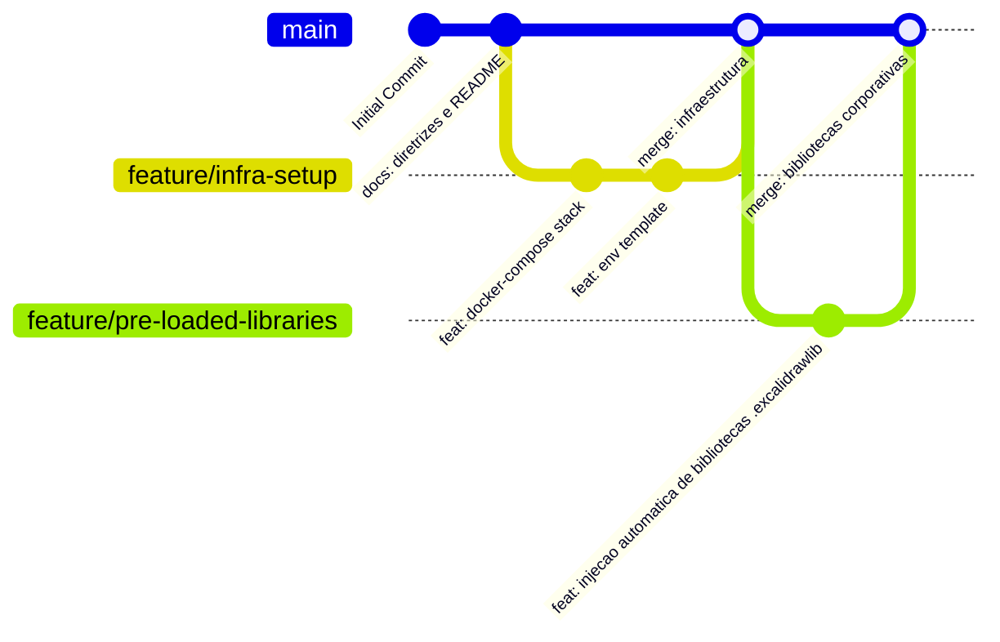

# 🎨 Excalidraw (Desenho)

> **Whiteboard virtual minimalista, colaborativo e auto-hospedado com bibliotecas corporativas pré-carregadas para ideação ágil e diagramação de arquitetura.**

[](https://docs.docker.com/compose/)
[](https://excalidraw.com)
[](#-bibliotecas-corporativas-pré-carregadas)
[](#-colaboração-em-tempo-real--e2ee)
[](LICENSE)

---

## 🎯 Visão Geral & Motivação

### 💡 Por que escolhemos:
Interface minimalista e fluida estilo *whiteboard*, com **curva de aprendizado zero** e suporte nativo a **colaboração síncrona em tempo real**. Permite auto-hospedagem leve, garantindo **total soberania** sobre as sessões e dados trafegados.

### 🧩 Problema que resolve:
Elimina o atrito e a complexidade na hora de conduzir reuniões ágeis, dinâmicas de ideação, design sprints, mapas mentais e rascunhos rápidos de arquitetura, permitindo que membros técnicos e não técnicos colaborem simultaneamente sem barreiras.

---

## 📦 Bibliotecas Corporativas Pré-Carregadas (`.excalidrawlib`)

Diferente do Excalidraw padrão, este ambiente conta com injeção automática de bibliotecas no **IndexedDB** do navegador no primeiro acesso, disponibilizando imediatamente:

- ☁️ **Cloud & DevOps**: AWS EC2/S3/Lambda/RDS, Kubernetes Pods/Ingress, Docker, GCP Cloud Run, Redis, Postgres.
- 🏗️ **C4 Model**: System Context, Containers (Web, API, DB), Components e Atores.
- ⚙️ **Arquitetura de Software**: API Gateways, Microserviços, Kafka Message Broker, RabbitMQ, Nginx, Vault.
- 📱 **UI & Wireframing**: Botões, Campos de Formulário, Modais, Cards, Headers.
- 📊 **Processos & Ágil**: Sticky Notes de Retrospectiva, Portões de Decisão e Eventos BPMN.

---

## 🏗️ Arquitetura do Sistema



---

## 🚀 Como Executar (Quickstart)

### Pré-requisitos
- [Docker](https://docs.docker.com/get-docker/) (v20.10+)
- [Docker Compose](https://docs.docker.com/compose/) (v2.0+)

### 1. Clonar e Acessar o Repositório
```bash
git clone git@github-dxcdc:dxcdc/Desenho.git
cd Desenho
```

### 2. Configurar Variáveis de Ambiente
```bash
cp infra/.env.example infra/.env
```

### 3. Construir e Iniciar os Serviços
```bash
docker compose -f infra/docker-compose.yml up -d --build
```

### 4. Acessar a Aplicação
- **Frontend Web com Bibliotecas**: [http://localhost:8092](http://localhost:8092)
- **Servidor de Colaboração (Status)**: [http://localhost:8093](http://localhost:8093)

Para parar os serviços:
```bash
docker compose -f infra/docker-compose.yml down
```

---

## 🔒 Colaboração em Tempo Real & E2EE

O Excalidraw utiliza um modelo de segurança **Zero-Knowledge / End-to-End Encryption (E2EE)** nas salas de colaboração:

1. Ao criar uma sessão compartilhada, uma chave de criptografia AES-GCM de 128 bits é gerada diretamente no navegador do anfitrião.
2. A chave é anexada ao fragmento da URL (`#room=...,<chave>`), o qual **nunca é enviado ao servidor**.
3. O servidor (`excalidraw-room`) atua apenas como um relay de pacotes criptografados via WebSocket, sem capacidade de inspecionar ou decifrar os desenhos.

---

## 📁 Estrutura do Repositório

```text
Desenho/
├── README.md                          # Painel principal com visão geral e instruções de execução
├── .gitignore                         # Regras de exclusão de arquivos sensíveis e temporários
├── .github/
│   └── workflows/
│       └── automatizar_issues.yml     # Workflow de automação de issues no GitHub
├── docs/                              # Governança, infraestrutura e sustentação
│   ├── diretrizes_documentacao.md     # Padrões editoriais, Git Graph e ADRs (ADR-001 a 005)
│   ├── estrategia_execucao.md         # Estratégia de branches e contribuição Git
│   ├── ajuda_infra.md                 # Arquitetura detalhada, portas, Docker e gestão de bibliotecas
│   ├── troubleshooting.md             # Soluções para problemas de conexão e portas
│   └── prompt_ia.md                   # Contexto mestre para assistentes de IA no projeto
├── infra/                             # Infraestrutura e orquestração de containers
│   ├── Dockerfile.web                 # Build customizado com injeção de bibliotecas
│   ├── docker-compose.yml             # Manifesto de execução dos serviços Excalidraw + Room
│   ├── .env.example                   # Template de variáveis de ambiente
│   └── assets/
│       └── libraries/                 # Pacotes .excalidrawlib, manifest.json e script de auto-load
└── prompts/                           # Prompts especializados para diagramação e arquitetura
```

---

## 🌿 Fluxo Git e Visualização de Branches

Seguimos a convenção de branches e visualização gráfica via Git Graph CLI:



Para visualizar o histórico no terminal:
```bash
git log --graph --oneline --all --decorate
```

---

## 📚 Documentação Adicional

- [📖 Diretrizes de Documentação e Governança](docs/diretrizes_documentacao.md)
- [🛠️ Ajuda e Operação de Infraestrutura](docs/ajuda_infra.md)
- [🔍 Troubleshooting & Resolução de Problemas](docs/troubleshooting.md)
- [🌿 Estratégia de Execução e Git Flow](docs/estrategia_execucao.md)
