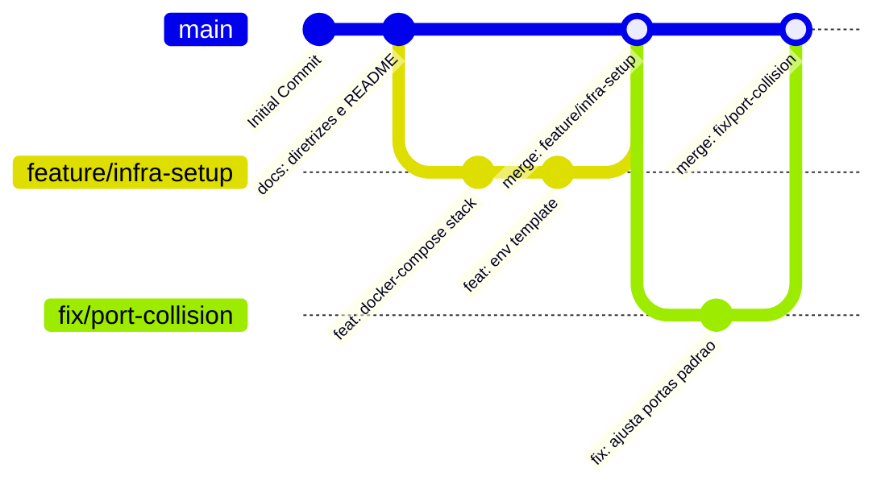

# 🌿 Estratégia de Execução & Git Flow

Este documento estabelece o fluxo de trabalho com Git, convenções de commits, padrão de branches e ciclo de vida de contribuições para o repositório **Desenho**.

---

## 1. Padrão de Branches

- `main`: Branch de produção, estável e sempre pronta para deploy.
- `feature/*`: Novas funcionalidades, scripts ou configurações de infraestrutura (ex: `feature/traefik-proxy`).
- `fix/*`: Correções de bugs ou ajustes em arquivos de configuração (ex: `fix/websocket-headers`).
- `docs/*`: Melhorias ou adições na documentação (ex: `docs/atualiza-troubleshooting`).

---

## 2. Diagrama de Fluxo Git (Mermaid)



---

## 3. Convenção de Commits (Conventional Commits)

Utilize mensagens concisas no formato `<tipo>: <descrição em português>`:

- `feat:` Inclusão de novas receitas, containers ou scripts.
- `fix:` Correção de falhas em configurações existentes.
- `docs:` Alterações e melhorias em arquivos markdown.
- `ci:` Alterações em workflows do GitHub Actions.
- `chore:` Tarefas de manutenção ou dependências.

---

## 4. Visualização Gráfica no Terminal

```bash
git log --graph --oneline --all --decorate
```
